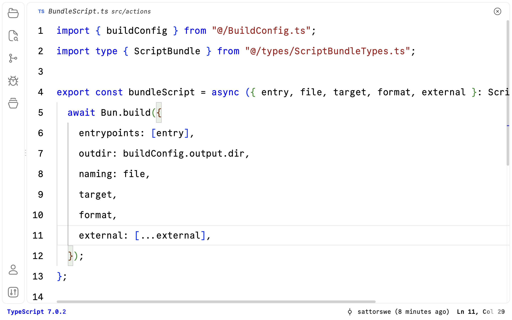
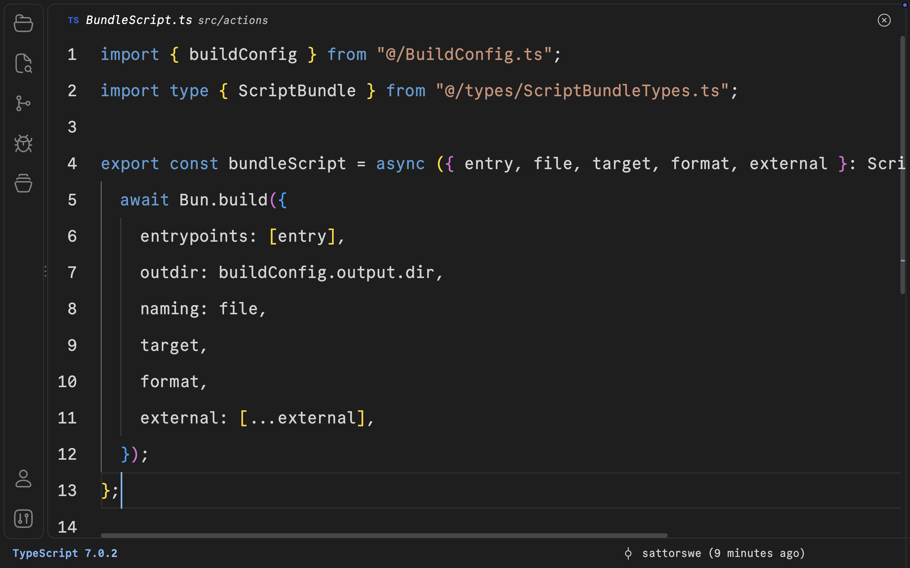
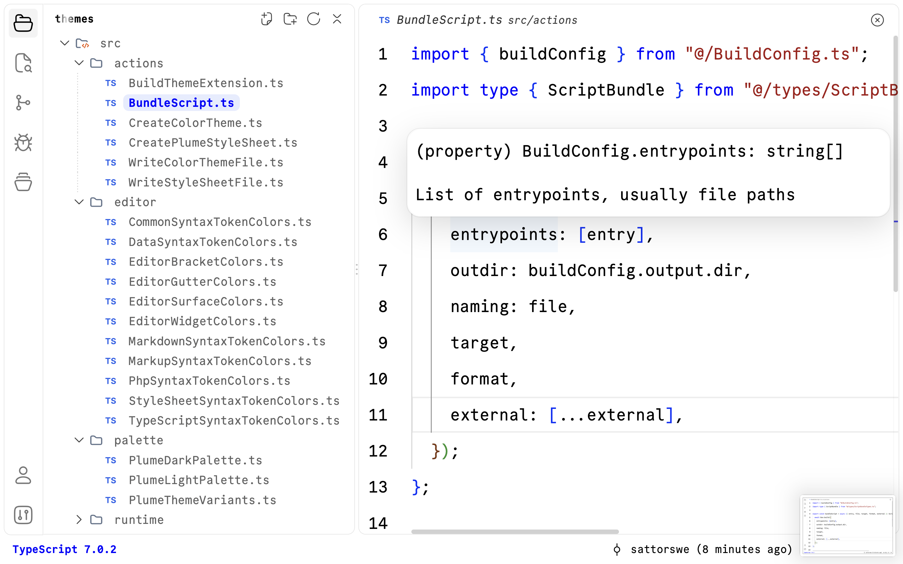
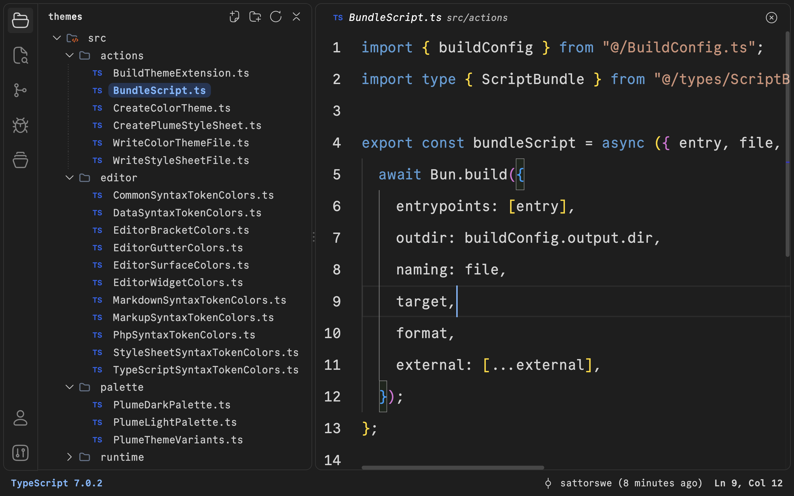
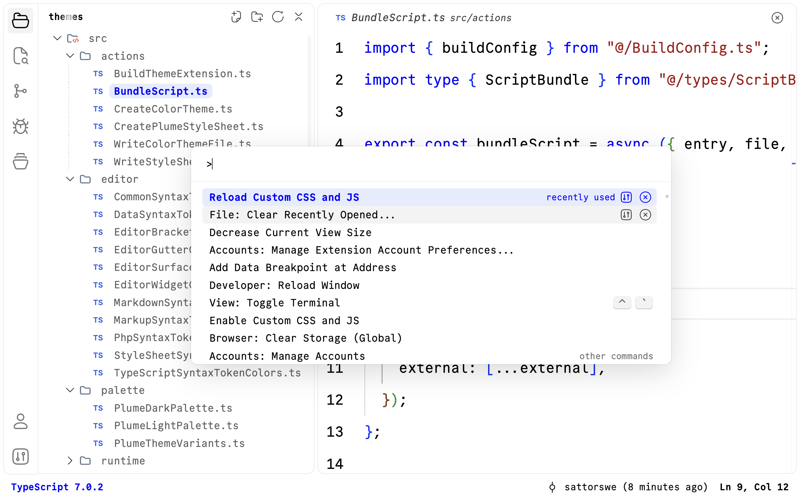
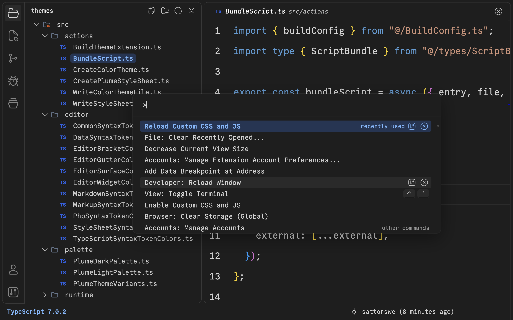

# Plume Themes

A minimal light and dark theme for VS Code, in the spirit of the classic Visual Studio themes: keywords, strings, comments, and numbers get a color, everything else stays plain. Plume also reshapes the VS Code interface itself with soft rounded cards, quiet selections, and a clean status bar.

This extension is not published to the VS Code Marketplace. You download it from [GitHub Releases](https://github.com/sattorswe/plume-themes/releases) and install it with one command.

## Screenshots

| Plume Light | Plume Dark |
| --- | --- |
|  |  |
|  |  |
|  |  |

## What you get

Plume is made of three layers. Each one is installed by a different step below.

| Layer | What it does | Needs |
| --- | --- | --- |
| **Color themes** | Plume Light and Plume Dark, including Git and diff colors, error and warning squiggles, and the Settings, Welcome, and Extensions pages. VS Code switches between them automatically with your macOS appearance. | Only the extension |
| **Layout defaults** | Wider line spacing, a compact gutter, a clean editor header, the file name as the window title, and a status bar item that shows the language of any file and, for common languages, its version (for example `PHP 8.5.11` or `TypeScript 7.0.2`). | Only the extension |
| **Plume CSS** | Rounded cards for the Command Palette, the Find widget, hovers, suggestions, and notifications; rounded rows, inputs, and buttons in Settings, Welcome, and extension pages; soft pill selection in the Explorer; thin scrollbars; a tidier editor header without split and `...` buttons; the CommitMono interface font; and the shimmering status bar labels. | The Custom CSS and JS Loader extension and the CommitMono font |

If you skip the Plume CSS layer, the themes and layout defaults still work. You just get the standard VS Code shapes and font.

## Requirements

Check each item before you start. The install steps assume all of them.

1. **macOS.** Plume is made and tested on macOS. The colors work everywhere, but the steps below use macOS paths and shortcuts.
2. **VS Code 1.139 or newer**, installed in `/Applications`.
3. **The `code` command.** Open VS Code, press `Cmd+Shift+P`, and run **Shell Command: Install 'code' command in PATH**. Check it in a new terminal:

   ```bash
   code --version
   ```

4. **The CommitMono font.** Plume CSS uses it for the interface, and it is the recommended editor font:

   ```bash
   brew install --cask font-commit-mono
   ```

Optional:

- **Language toolchains on your `PATH`**, if you want the status bar to show their versions. Without one, the item shows only the language name. See [Language versions](#language-versions).
- **[Plume Icons](https://github.com/sattorswe/plume-icons)**, the matching product icon theme.

## Install

### 1. Install the extension

Download the latest release and install it into VS Code:

```bash
curl -fLO https://github.com/sattorswe/plume-themes/releases/latest/download/plume-themes.vsix
code --install-extension plume-themes.vsix
rm plume-themes.vsix
```

If VS Code is already open, press `Cmd+Shift+P` and run **Developer: Reload Window** so the theme and its layout defaults load.

To build the extension yourself instead, see [Build from source](#build-from-source).

### 2. Check the theme

Plume turns on automatic switching for you. Open **Settings** (`Cmd+,`), search for `autoDetectColorScheme`, and make sure **Window: Auto Detect Color Scheme** is checked. VS Code now uses Plume Light when macOS is light and Plume Dark when macOS is dark.

To pick one theme yourself instead, uncheck that setting, press `Cmd+K Cmd+T`, and choose **Plume Light** or **Plume Dark**.

### 3. Set the editor font

Open your `settings.json` (`Cmd+Shift+P`, then **Preferences: Open User Settings (JSON)**) and add:

```json
"editor.fontFamily": "CommitMono"
```

### 4. Turn on Plume CSS

1. Install the loader:

   ```bash
   code --install-extension be5invis.vscode-custom-css
   ```

2. In VS Code, press `Cmd+Shift+P` and run **Developer: Reload Window**.
3. Plume adds its stylesheet to `vscode_custom_css.imports` in your settings by itself, then asks **Plume styles changed. Apply them now?** Click **Apply Styles**.
4. VS Code may say that your installation "appears to be corrupt". This is expected, because the loader edits VS Code's own files. Click **Don't Show Again**.
5. Quit VS Code completely with `Cmd+Q` and open it again. Reload Window is not enough.

### 5. Clean up the status bar

Plume shows the language and version on the left and the cursor position (`Ln 1, Col 1`) on the right. VS Code doesn't let extensions hide its other status bar items, so hide them once by hand:

1. Right-click an empty part of the status bar.
2. Uncheck everything except **Plume Language Version** and **Editor Selection**.

VS Code remembers this choice.

### 6. Check that everything works

Open a TypeScript or PHP file. You should see:

- A white editor in light mode, or dark gray in dark mode, with blue keywords, and black (or light gray) line numbers.
- Only the file name at the top of the window. The editor header shows the file name, the close button, and tools for the current file, such as Markdown preview, but no split or `...` buttons.
- A bold blue `TypeScript 7.0.2` (or `PHP ...`) at the bottom left and a bold `Ln, Col` at the bottom right, both with a moving shimmer.
- Rounded cards when you press `Cmd+Shift+P`, and the interface in the CommitMono font.

If only the first two items work, Plume CSS is not active. Go back to step 4.

## Update

Download the latest release and install it over the current one:

```bash
curl -fLO https://github.com/sattorswe/plume-themes/releases/latest/download/plume-themes.vsix
code --install-extension plume-themes.vsix --force
rm plume-themes.vsix
```

Then run **Developer: Reload Window** in VS Code. If the stylesheet changed, Plume asks **Plume styles changed. Apply them now?** Click **Apply Styles**, then quit VS Code with `Cmd+Q` and open it again.

## After a VS Code update

A VS Code update replaces the files the loader edited, so the Plume CSS layer disappears. Plume notices this on the next start and asks you to apply the styles again. Click **Apply Styles**, then quit and reopen VS Code. The color themes are not affected.

## Language versions

The status bar shows the name of every language VS Code knows. For these languages it also shows the version, read from the command in the second column:

| Language | Command |
| --- | --- |
| TypeScript, TypeScript JSX | the project's `node_modules/typescript`, otherwise the version built into VS Code |
| JavaScript, JavaScript JSX | `node --version` |
| PHP | `php -r "echo PHP_VERSION;"` |
| Python | `python3 --version` |
| Go | `go version` |
| Rust | `rustc --version` |
| Java | `java --version` |
| Ruby | `ruby --version` |
| Dart | `dart --version` |
| Swift | `swift --version` |
| C, C++, Objective-C | `clang --version` |
| Shell Script | `bash --version` |

Each command runs once per VS Code session. If a command is missing, the item shows only the language name.

## Settings Plume changes

The extension sets these defaults. Any value in your own `settings.json` wins over them, so remove a line from your settings if you want Plume's value.

| Setting | Plume value | Why |
| --- | --- | --- |
| `editor.lineHeight` | `2.2` | Airier lines |
| `editor.lineNumbersMinChars` | `2` | Compact line number column |
| `editor.lineDecorationsWidth` | `24` | Space between line numbers and code |
| `editor.glyphMargin` | `false` | Removes the empty column left of line numbers |
| `breadcrumbs.enabled` | `false` | Only the file name in the editor header |
| `workbench.tree.indent` | `16` | File tree indentation |
| `workbench.tree.renderIndentGuides` | `always` | Shows the dotted guide of the active folder |
| `window.commandCenter` | `false` | Removes the search box from the title bar |
| `window.title` | `${activeEditorShort}` | Shows only the file name as the window title |
| `window.autoDetectColorScheme` | `true` | Follows the macOS appearance |
| `workbench.preferredLightColorTheme` | `Plume Light` | Theme for light mode |
| `workbench.preferredDarkColorTheme` | `Plume Dark` | Theme for dark mode |
| `vscode_custom_css.statusbar` | `false` | Hides the loader's own status bar icon |

## Uninstall

1. Run **Disable Custom CSS and JS** from the Command Palette, then quit and reopen VS Code.
2. Remove the extension:

   ```bash
   code --uninstall-extension plume.plume-themes
   ```

3. Delete the `vscode_custom_css.imports` entry from your `settings.json`.
4. Press `Cmd+K Cmd+T` and pick another theme.

## Troubleshooting

**Style changes don't show up.** Run **Developer: Reload Window** and click **Apply Styles** when Plume asks. If Plume doesn't ask, run **Reload Custom CSS and JS** from the Command Palette, then quit and reopen VS Code.

**Plume never asks to apply styles.** Plume only asks when the Custom CSS and JS Loader is installed. Check that `be5invis.vscode-custom-css` appears in `code --list-extensions`.

**The status bar still shows Git, Spaces, UTF-8, and other items.** Hide them as described in step 5. If they come back after you hid them, quit VS Code with `Cmd+Q` and open it again.

**The title bar is gone.** VS Code hides an empty title bar in full screen. Use a normal or maximized window instead of full screen.

**Breakpoints are invisible.** Plume turns off the column where VS Code draws them. Add `"editor.glyphMargin": true` to your `settings.json` while you debug.

**The status bar shows a language without a version.** Make sure the command from [Language versions](#language-versions) works in a terminal, then restart VS Code. Languages that are not in that table only show their name.

**The loader reports a permission error.** VS Code must be in `/Applications` and owned by your user account.

**A Plume setting has no effect.** Your own `settings.json` probably sets the same key. Remove it there.

## Build from source

You need [Bun](https://bun.sh) 1.4.2 or newer and Git:

```bash
brew install oven-sh/bun/bun
```

Then download the code and install it into VS Code:

```bash
git clone https://github.com/sattorswe/plume-themes.git
cd plume-themes
bun install
bun run install:vscode
```

Bun may print `Blocked 1 postinstall`. That is expected and safe: it is a signing helper for the Marketplace, which Plume doesn't use.

`bun run install:vscode` builds the extension, packs it into a temporary `.vsix` file, installs it into VS Code, and deletes the temporary file. Nothing is left in the project folder. Continue with [step 2 of Install](#2-check-the-theme).

## How the build works

`bun run build` writes everything into `dist/`:

1. `plume-light-color-theme.json` and `plume-dark-color-theme.json`, generated from one set of color rules and two palettes.
2. `plume.css`, the Plume CSS layer, generated with PostCSS. Its colors are CSS variables that switch with the active theme.
3. `extension.cjs`, the small runtime that adds the language version to the status bar and keeps the Plume stylesheet registered with the Custom CSS and JS Loader.

`bun run typecheck` checks the code, `bun run package` builds `plume-themes.vsix` in the project folder, and `bun run install:vscode` builds, packs, and installs the extension.

## Project structure

```
src/
├── index.ts          Build entry point
├── package.ts        Package entry point
├── install.ts        Install entry point
├── BuildConfig.ts    Theme names, output files, and bundle settings
├── actions/          One build step per file
├── palette/          Light and dark palettes and the theme variants
├── editor/           Editor and syntax colors
├── workbench/        Colors for the rest of the interface
├── styles/           Plume CSS rules and shared style tokens
├── typography/       Font settings
├── runtime/          Status bar item and stylesheet registration
├── support/          Small shared helpers
└── types/            Shared TypeScript types
```

## Release a new version

Releases are built by GitHub Actions from `.github/workflows/release.yml`.

1. Raise `version` in `package.json` and commit it.
2. Tag the commit and push the tag:

   ```bash
   git tag v0.0.2
   git push origin v0.0.2
   ```

The workflow builds `plume-themes.vsix` and publishes it as a new release. The install commands above always download the latest one.
